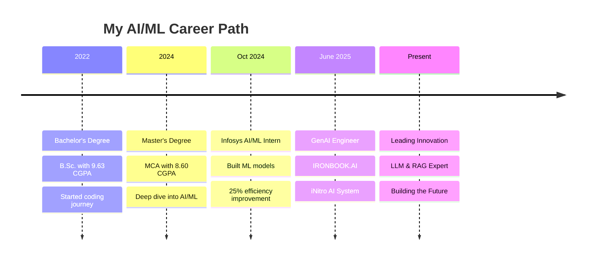

# Hi there! 👋 I'm Vaibhav Parab

<div align="center">
  
</div>

<div align="center">
  
[](https://www.linkedin.com/in/vaibhavparab19)
[](https://github.com/vaibhavparab19)
[](mailto:vaibhavparab0919@gmail.com)

</div>

<div align="center">
  
</div>

---

## 🚀 About Me


🔬 **Innovative Data Scientist & AI/ML Engineer** with a proven track record of delivering data-driven solutions that improved operational efficiency by **25%** and enhanced predictive accuracy across business applications.

💡 Currently developing **iNitro AI Decisioning System** - a GenAI-powered CRM solution using LLMs, LangChain, and multimodal AI that reduced manual planning by **40%**.

🎯 **Specializing in:**
- 🤖 **Generative AI & LLMs** (OpenAI, Hugging Face)
- 🧠 **Agentic Workflows & RAG Pipelines**
- 📊 **Machine Learning & Deep Learning**
- 🔗 **LangChain & LangGraph Implementation**
- 🎯 **Intelligent Decisioning Systems**

---

## 🛠️ Tech Arsenal

<div align="center">

### 👨‍💻 Programming Languages
<div style="display: flex; flex-wrap: wrap; gap: 10px; justify-content: center; animation: slideInUp 0.5s ease-out;">


</div>

### 🤖 AI/ML Frameworks & Libraries
<div style="animation: slideInLeft 0.5s ease-out 0.2s both;">


</div>

### 📊 Data Science & Analytics
<div style="animation: slideInRight 0.5s ease-out 0.4s both;">


</div>

### 🚀 Web Frameworks & Deployment
<div style="animation: slideInUp 0.5s ease-out 0.6s both;">


</div>

### 🗄️ Databases & Vector Stores
<div style="animation: fadeIn 0.5s ease-out 0.8s both;">


</div>

</div>

---

## 🏆 What Makes Me Unique

<div align="center">

<table>
<tr>
<td align="center" width="50%">

### 💼 Professional Strengths

- **🎯 Results-Driven:** Improved operational efficiency by 25% at Infosys
- **⚡ Innovation Focus:** Reduced manual planning by 40% with AI automation
- **🤝 Collaborative Leader:** Led cross-functional teams on ML projects
- **📊 Data-Driven Decision Making:** Expert in turning data into actionable insights

</td>
<td align="center" width="50%">

### 🌟 Personal Values

- **🏥 Continuous Learning:** Always exploring cutting-edge AI technologies
- **🎯 Problem Solving:** Love tackling complex technical challenges
- **🌍 Impact-Oriented:** Building solutions that make a real difference
- **⚖️ Work-Life Balance:** Integrating martial arts discipline into tech

</td>
</tr>
</table>

</div>

---

## 🎯 My Professional Journey

<div align="center">



</div>

---

## 💼 Professional Experience

<details>
<summary><strong>🏢 IRONBOOK.AI | GenAI Engineer | June 2025 - Present</strong></summary>
<br>

🚀 **Building iNitro AI Decisioning System** - Revolutionary GenAI-powered CRM solution
- 🧠 **Technologies:** LLMs (OpenAI, Hugging Face), LangChain, LangGraph
- ⚡ **Impact:** Automated CRM decisioning, reducing manual effort by **40%**
- 🔧 **Architecture:** Designed agentic workflows and RAG pipelines with vector DB integrations (Pinecone, FAISS)
- 📊 **Results:** Enhanced campaign personalization through context engineering and knowledge graphs

</details>

<details>
<summary><strong>🏢 Infosys | AI/ML Intern | Oct 2024 - Dec 2024</strong></summary>
<br>

📈 **Machine Learning Development & Optimization**
- 🤖 **Models:** Built and deployed ML models using TensorFlow and Scikit-learn
- 📊 **Performance:** Improved operational efficiency by **25%** through model optimization
- 🔍 **Applications:** Developed models for classification, regression, and clustering
- ⚙️ **Optimization:** Applied hyperparameter tuning, cross-validation, and regularization
- 📋 **Evaluation:** Comprehensive model assessment using precision, recall, F1-score, and ROC-AUC

</details>

---

## 🎓 Educational Excellence

<div align="center">

| 🎯 Degree | 🏛️ Institution | 📅 Year | 🏆 Performance |
|-----------|----------------|---------|---------------|
| **Master of Computer Applications** | Jain University | 2024 | 🌟 **8.60/10.0 CGPA** |
| **Bachelor of Science** | B.K. Birla College | 2022 | 🌟 **9.63/10.0 CGPA** |

</div>

---

## 🏆 Featured Projects

### 🛡️ **CyberShield - AI-Driven Cyberbullying Detection**

<div align="center">
  
</div>

- 🎯 **Mission:** Developed ML-based system to detect and classify cyberbullying across social media platforms
- 📊 **Technology Stack:** NLP techniques, Deep Learning models, Sentiment Analysis
- 🔍 **Innovation:** Real-time detection with contextual cues and behavioral pattern analysis  
- 🚀 **Scalability:** Designed for seamless integration into online platforms
- ✅ **Achievement:** High accuracy in detecting various forms of cyberbullying

### 🤖 **iNitro AI Decisioning System**

<div align="center">
  
</div>

- ⚡ **Vision:** GenAI-powered CRM system revolutionizing customer engagement
- 🔗 **Architecture:** Integrated LangChain, LangGraph, and advanced vector databases
- 📈 **Automation:** Intelligent customer goal generation and next-best action recommendations
- 💼 **Impact:** Enhanced customer engagement and strategic decision-making
- 🎯 **Results:** 40% reduction in manual planning effort

---

## 🏅 Certifications & Recognition

<div align="center">

### 📜 Professional Certifications


</div>

### 🥋 Personal Achievements & Leadership

<div align="center">

| 🏆 Achievement | 📝 Description | 🎯 Impact |
|---------------|----------------|-----------|
| **🥇 Karate National Medalist** | Official recognition at national level | Discipline & perseverance in everything I do |
| **🏆 Consecutive State Gold Medalist** | Multiple state-level victories | Consistency and excellence mindset |
| **🎖️ NCC 'C' Certificate with 'A' Grade** | National Cadet Corps highest honor | Leadership and teamwork skills |
| **🌟 "Best Cadet" at Republic Day Camp** | Mumbai Contingent Representative | Recognition for exceptional performance |
| **👨‍🎓 Class & Sports Representative** | University-level leadership roles | Natural leadership and communication abilities |

</div>

---

## 📊 My Development Philosophy

<div align="center">

```python
class VaibhavParab:
    def __init__(self):
        self.name = "Vaibhav Parab"
        self.role = "Data Scientist & AI/ML Engineer"
        self.location = "Mumbai, India 🇮🇳"
        
    def current_focus(self):
        return [
            "🔬 Advancing GenAI Research in multimodal AI systems",
            "🚀 Building Scalable RAG Pipelines for enterprise applications",
            "📚 Exploring Advanced Reasoning Models and orchestration frameworks",
            "🌟 Contributing to Open Source AI/ML projects",
            "💡 Developing Innovative Solutions for intelligent decisioning systems"
        ]
    
    def life_philosophy(self):
        return {
            "code": "Clean, efficient, and well-documented",
            "learning": "Never stop exploring new technologies",
            "collaboration": "Great solutions come from great teamwork",
            "impact": "Technology should solve real-world problems",
            "balance": "Martial arts discipline meets coding creativity"
        }
    
    def fun_facts(self):
        return [
            "🥋 Can break boards with bare hands AND debug complex code",
            "🎯 Represented Mumbai at national level competitions",
            "🤖 Dream of building AI that makes the world a better place",
            "📚 Love reading research papers over morning coffee",
            "🌅 Early riser who codes best at dawn"
        ]
```

</div>

---

## 🔥 Current Mission & Vision

<div align="center">

### 🎯 **2025 Goals**


</div>

🚀 **Short-term Objectives:**
- 🔬 **Research Excellence:** Publish papers on multimodal AI systems
- 💼 **Product Innovation:** Launch iNitro to production with enterprise clients  
- 🌟 **Open Source Contribution:** Contribute to major AI/ML frameworks
- 📚 **Knowledge Sharing:** Conduct workshops on GenAI and RAG pipelines

🌟 **Long-term Vision:**
- 🏗️ **Founding Impact:** Build AI solutions that revolutionize business intelligence
- 🌍 **Global Reach:** Create AI systems used by millions worldwide
- 🎓 **Thought Leadership:** Become a recognized expert in intelligent decisioning systems
- 💡 **Innovation Hub:** Establish research lab focusing on ethical AI development

---

## 🤝 Let's Build the Future Together!

<div align="center">

 

### 💬 I'm always excited to collaborate on:

🔬 **Innovative AI/ML projects** that push boundaries  
🚀 **Generative AI research** and applications  
💡 **Intelligent decisioning systems** for enterprise  
🌟 **Open-source contributions** to the AI community  
🎯 **Startup ventures** in the AI/ML space  

---

### 📧 **Get In Touch**

[](https://www.linkedin.com/in/vaibhavparab19)
[](mailto:vaibhavparab0919@gmail.com)
[](https://github.com/vaibhavparab19)

---

### 💙 **Thank you for visiting!**

*"The best way to predict the future is to create it."* - Peter Drucker

<em><b>I love connecting with fellow innovators and dreamers!</b> If you want to discuss AI, share ideas, or just say hello, <b>I'll be thrilled to hear from you!</b> 🚀✨</em>

---

<details>
<summary>🎵 <strong>Currently Listening To</strong></summary>
<br>

🎧 **Coding Playlist Vibes:**
- 🎼 Lo-fi Hip Hop for Deep Focus Sessions
- 🎹 Classical Music for Algorithm Design  
- 🎸 Instrumental Rock for Debugging Adventures
- 🌊 Ambient Sounds for Research & Reading

*Music fuels creativity and keeps the code flowing!* 🎶

</details>

<div align="center">

⭐️ **From [Vaibhav Parab](https://github.com/vaibhavparab19) - Crafting the Future with AI** ⭐️

</div>

</div>
